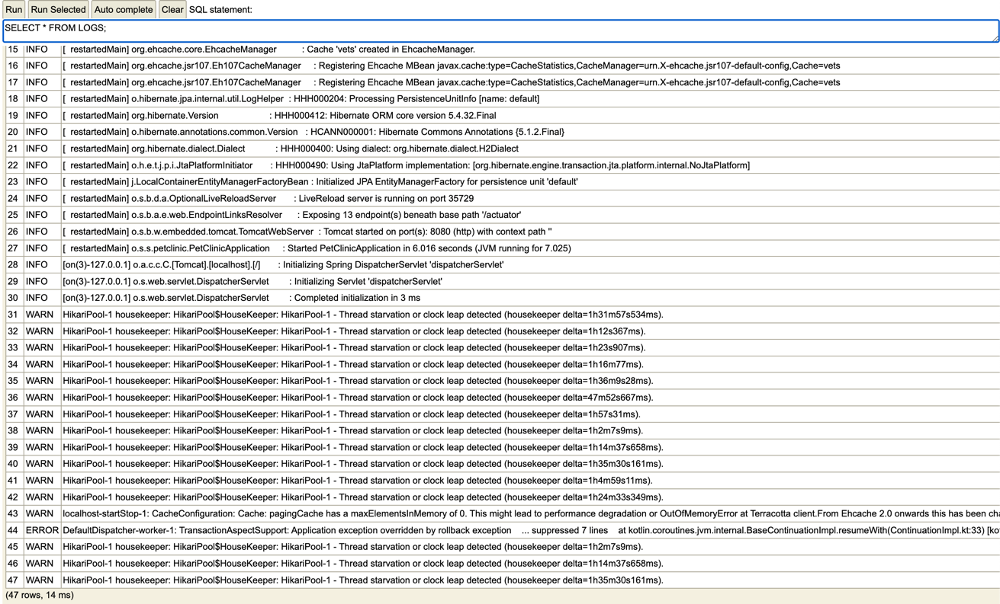
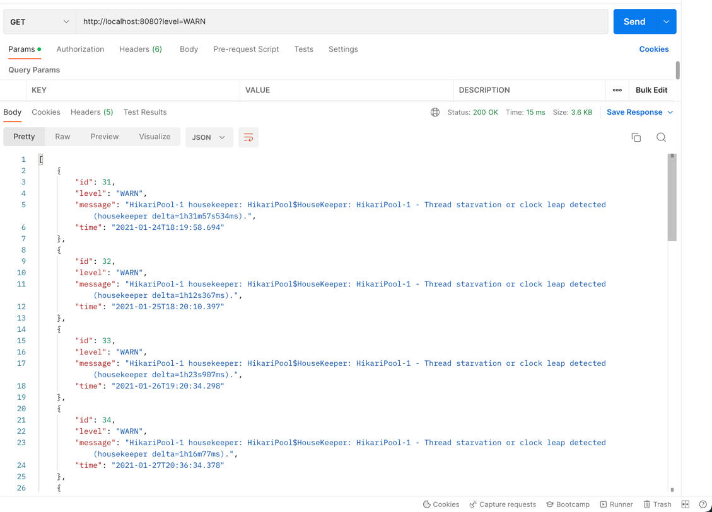
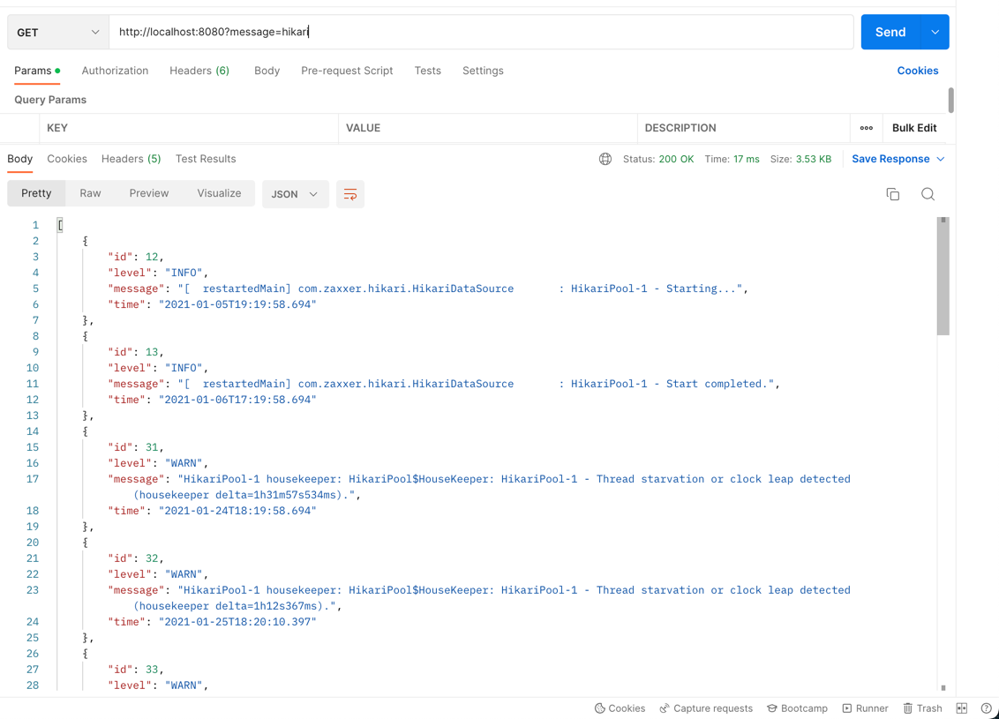
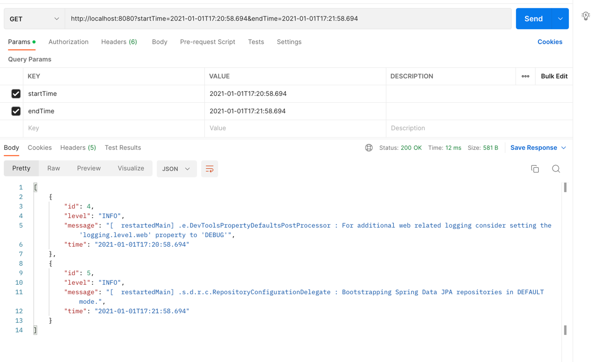
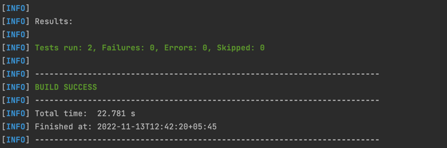

#  Assessment Project: Log Search

## System Requirements
* Java 17

## Running the Application
```
./mvnw spring-boot:run
```

## Running Unit Tests
```
./mvnw -Dtest=AbstractParamConfigurationTest test
```

## API

### Endpoint
```
http://localhost:8080/
```

### Query Params
* level
* startTime
* endTime
* message

```
http://localhost:8080?level=INFO&message=database
```

## Assumptions
* The format of the log is consistent, i.e. `LEVEL : DATETIME MESSAGE`
* Lines that do not follow the valid format(`LEVEL : DATETIME MESSAGE`) is appended to the message of the latest log.
* A line cannot consist of more than 1 log.
* Invalid query parameters are ignored by default.
* The log file is parsed each time at the server's startup.
* Liquibase can be used for creating tables in the H2 database.
* Libraries such as Lombok and Liquibase can be used.
* Everything that comes after level and time is considered as a message.
* The between query for log time is inclusive.

## If given more time
* More unit tests, currently only two were written
* Integration tests for QueryCreator Util. Create an H2 database in the startup and tests use cases such as invalid Operator in configuration.
* Implement Error Handlers, for example, send Bad Request when invalid query params are sent.

## Optimization of the application for millions of data

### Problem Statement
If there are millions of data being parsed, it might overload the memory.

### Approach
1. Read the logs line by line as and store the line in a list.
2. Define a threshold such that the memory isn't overloaded if the size of the list is below.
3. If the threshold is reached, trigger the log parsing operations for the particular batch,
   store them in the database, clear the list and resume reading of log file
4. The operation in Step 3 can be done via multithreading for better performance.

## Screenshots
### Parsing and storing data in the H2 database


### Filtering logs by level


### Filtering logs by message


### Filtering logs by time(startTime and endTime)


### Running tests

